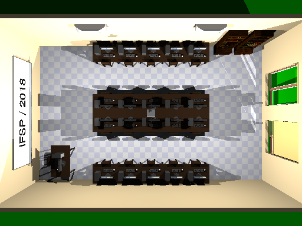
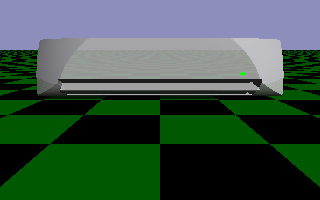
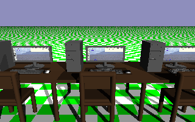
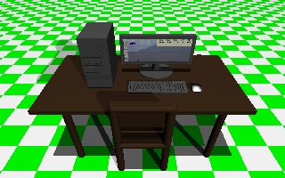
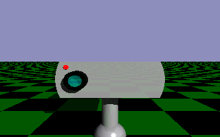
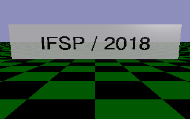

# Classroom

This is a simple 3D Model of a classroom

## Setup

Just clone the project and open the `_Classroom.pov` file.  
You need the POV-Ray software installed in your computer.

## Files

- All the files with the name "OBJ" are files that are my creation.
- All the files with the name "EXT" are files that aren't my creation.
- The main file `_Classroom.pov` just call the objects and define light and the camera view.
- The folder `/Views` contains others perspects from the 3D.

## Created Objects

- Air conditioning (`OBJ_ArCondicionado.inc`)  

- Computer Tables and Monitor (`OBJ_Mesa.inc` and `OBJ_Mesa_Prof.inc`)  

- Projector (`OBJ_ProjetorTeto.inc`)  

- White Board (`OBJ_Quadro.inc`)  
